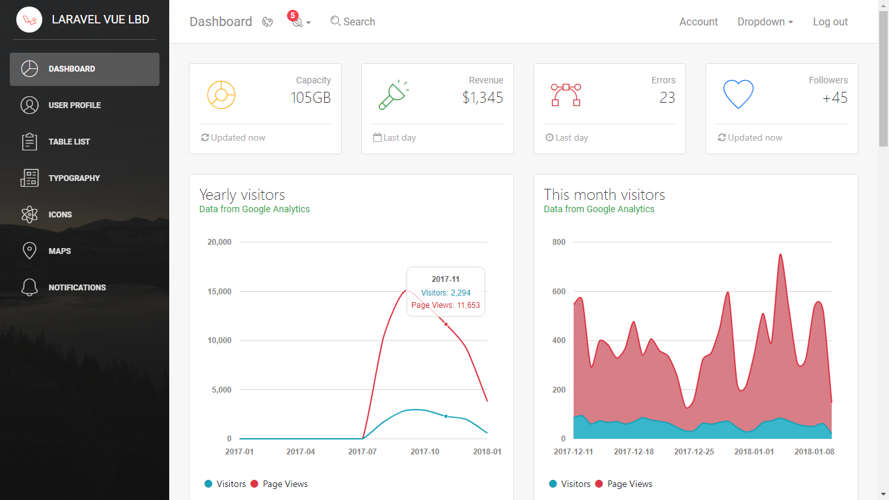
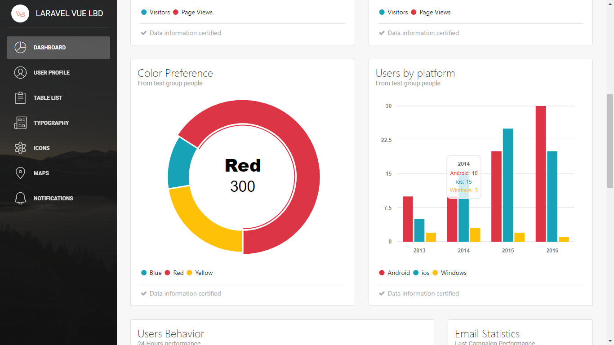

# Laravel Vue Light Bootstrap Dashboard [![version][version-badge]][CHANGELOG] [![license][license-badge]][LICENSE]

> Laravel Admin dashboard based on light bootstrap dashboard UI template + vue-router

This project is a Laravel application based on vue version of [Light bootstrap dashboard](https://www.creative-tim.com/product/vue-light-bootstrap-dashboard)


Check the [Live Demo here.](http://laravelvlbd.joaquinlozanoc.ml)


---



## :rocket: Getting started

Laravel Vue Light Bootstrap Dashboard is built on top of Bootstrap 4, Vuejs and Vue-router. To get started do the following steps:
1. Download or clone  the project
2. Make sure you have node.js (https://nodejs.org/en/)  and composer (https://getcomposer.org/) installed
3. Type `composer install` in the project folder
4. ren .evn.example to .env 
5. Type `php artisan key:generate` in the project folder
6. Type `npm install` in the project folder 
7. Type `npm run dev` in the project folder 
8. Type `php artisan serve` in the project folder to start the development server on http://localhost:8000

## :key: env file configuration

You need set this values in your .env file:

```
ANALYTICS_VIEW_ID= //for work with spatie/laravel-analytics
GOOGLE_API_KEY= // for work with google api service

```

## :loudspeaker: Remember

This project use [spatie/laravel-analytics](https://github.com/spatie/laravel-analytics), then you need configure it to get properly work with real data from Google Analytics.

## [Vue version documentation of Light bootstrap dashboard ](https://cristijora.github.io/vue-light-bootstrap-dashboard/documentation/#/buttons) from [Cristi Jora](https://github.com/cristijora)

[CHANGELOG]: ./CHANGELOG.md
[LICENSE]: ./LICENSE.md
[version-badge]: https://img.shields.io/badge/version-1.0.1-blue.svg
[license-badge]: https://img.shields.io/badge/license-MIT-blue.svg
